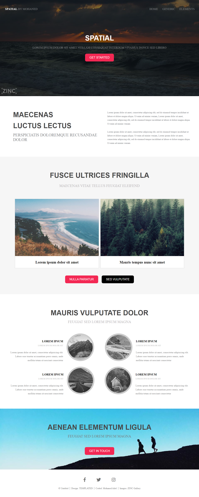

# Week2 MAC template


<p align="center" style="width: 500px; height: 500px">
    
</p>

## Preview
you can see it from here https://mohaned-second-temp.netlify.app/ 

## Description

Personal project to practice on web technology from million arab coders program

## Download

1. Clone Project:
    ```
        $ git clone https://github.com/Mohaned-Adel/Week2_MAC_temp.git
    ```
2. open it:
    open it with your code editor or open the index.html file.

3. enjoy it: 
    Start Hacking
